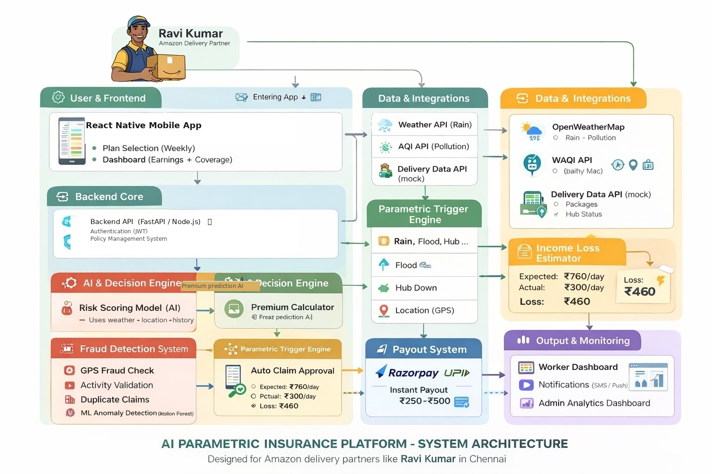
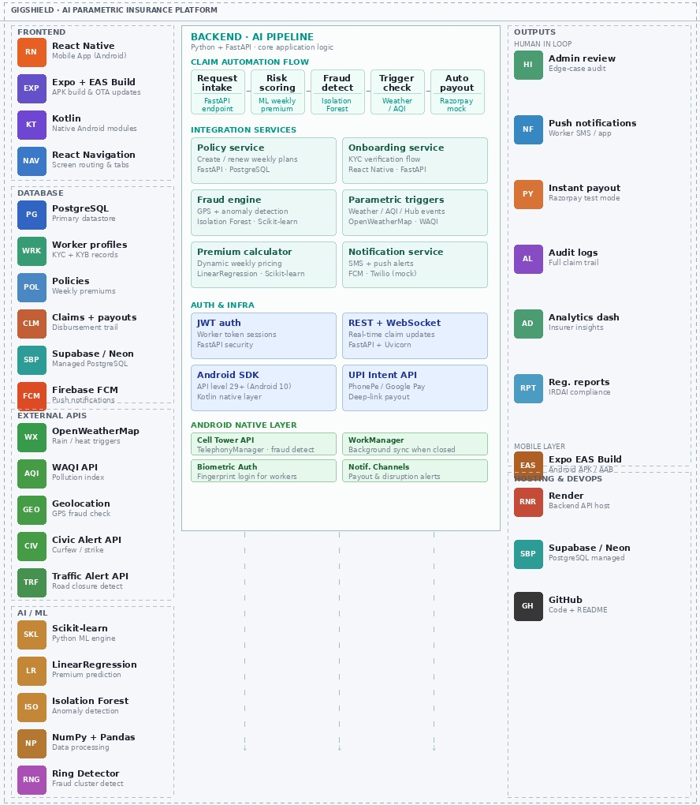

# 🛡️ GigShield — AI-Powered Parametric Income Insurance for India's Gig Economy

> **Guidewire DEVTrails 2026 · University Hackathon** &nbsp;|&nbsp; _"Seed. Scale. Soar."_

---

## 📌 Project Title

### **GigShield**
> _"Gig"_ → Gig delivery workers &nbsp;|&nbsp; _"Shield"_ → Financial protection

GigShield is an AI-powered parametric insurance platform that protects platform-based e-commerce delivery workers from income loss caused by uncontrollable external disruptions — with **zero paperwork, zero manual claims, and instant automated payouts.**

---

## 🚨 Problem Statement

In today's rapidly growing e-commerce ecosystem, millions of gig delivery workers operate without financial security, relying entirely on daily earnings to sustain their livelihoods. However, their income is extremely fragile — it can be disrupted instantly by external factors such as extreme weather, pollution surges, infrastructure failures, or regulatory restrictions.

A single day of disruption can mean **zero income**. Multiple days can lead to severe financial instability. Despite this vulnerability, gig workers are excluded from traditional insurance systems, which are often slow, claim-heavy, non-transparent, and not designed for real-time income protection.

**The critical gap:**

> Workers face real-time income loss, but existing systems provide delayed or no financial support. There is an urgent need for a real-time, trigger-based insurance system that can **instantly compensate income loss without manual intervention**, ensuring financial stability for gig workers in unpredictable environments.

---

## 👤 Target Persona

**Segment:** E-Commerce Delivery — Amazon / Flipkart

> 📄 Full persona card: [`persona-ravi.html`](./persona-ravi.html)

### Ravi Kumar — Amazon Last-Mile Delivery Associate, Chennai

| Attribute | Details |
|:---|:---|
| **Age** | 29 · Android user |
| **Platform** | Amazon Delivery · Tambaram +2 zones, Chennai |
| **Schedule** | 6 days/week · 9 AM – 7 PM |
| **Daily Income** | ₹760/day (35–45 pkgs × ₹14 + incentives) |
| **Weekly Income** | ₹4,500 – ₹5,200 |
| **Max Daily Loss** | ₹600/day |
| **Risk Profile** | 🔴 High Income Risk · No formal financial protection |

> *"One bad week can set my whole family back. I need something simple, automatic, and fair."*

---

### 📱 What Ravi Does in the GigShield App

This persona directly drives every screen and feature decision in the app:

| App Screen | What Ravi Does | Why It Matters |
|:---|:---|:---|
| **Onboarding / KYC** | Registers with name, Amazon Partner ID, operating zones | Enables zone-based trigger matching |
| **Plan Selection** | Picks Basic / Standard / Premium weekly plan | AI shows his personalised premium based on zone risk |
| **Home Dashboard** | Views active coverage status, weekly payout balance | One-glance safety net confirmation every morning |
| **Disruption Alert** | Receives push notification when trigger fires in his zone | Zero action needed — payout already initiated |
| **Claim Status** | Sees real-time claim processing status (Approved / Review) | Transparent, no black-box rejections |
| **Payout History** | Views all past payouts with disruption reason | Builds trust over time |
| **Appeal** | One-tap appeal if a claim is flagged | Protects honest workers from false positives |

---

### ⚠️ Why Ravi Needs This App

| Disruption | Daily Income Lost |
|:---|:---:|
| 🌧️ Heavy Rain / Flooding | **–₹480** |
| 🏭 Warehouse / Hub Shutdown | **–₹600** |
| 🚧 Road Closures / Blockades | **–₹300** |
| 🚫 Local Curfew / Zone Restriction | **–₹450** |

**Real scenario:** On a heavy rain day, Ravi earns ₹280 instead of ₹760. GigShield auto-detects the disruption and pays ₹250 — covering **52% of his loss**, automatically, before he even opens the app.

---

## 🗺️ Persona-Based Scenarios & Application Workflow

### Scenario 1 — Heavy Rainfall in Chennai

> Ravi logs in on Monday morning. It is raining heavily across Tambaram. GigShield's weather API detects precipitation exceeding 10mm/hr in his zone. A claim event is auto-created, fraud-checked, and ₹300 is deposited to his UPI account — **before he even checks his phone.**

```
Ravi Opens App → Dashboard shows "Active Coverage This Week"
        ↓
OpenWeatherMap detects Heavy Rain in Tambaram zone
        ↓
GigShield auto-creates claim → Isolation Forest fraud check
        ↓
Claim APPROVED → Razorpay initiates ₹300 payout
        ↓
Ravi receives SMS + App notification: "₹300 credited — Income Protected ✓"
```

---

### Scenario 2 — Warehouse Hub Shutdown

> Amazon's Tambaram hub shuts down due to a structural issue. Ravi receives zero packages. GigShield's mock delivery data API detects hub status as "DOWN", cross-validates with his active zone, and triggers an automatic income-loss payout of ₹250.

```
Hub Status API → "Tambaram Hub: DOWN"
        ↓
GigShield matches hub zone with Ravi's active policy
        ↓
Income loss estimated → Fraud score computed
        ↓
Auto payout ₹250 → UPI / Razorpay
        ↓
Admin dashboard logs event → Audit trail updated
```

---

### Scenario 3 — Local Curfew / Zone Restriction

> A sudden Section 144 curfew is declared in Ravi's delivery zone. GigShield's civic alert API flags the zone. Ravi's policy is active. The system auto-approves and pays out ₹460 — the estimated income lost for the day. No action needed from Ravi.

```
Mock Civic Alert API → "Section 144 declared in Tambaram zone"
        ↓
GigShield matches restricted zone with Ravi's active policy
        ↓
Income loss estimated (₹460) → Fraud score computed
        ↓
Claim APPROVED → Razorpay initiates ₹460 payout
        ↓
Ravi receives push notification: "Zone Restriction Detected — ₹460 Payout Initiated ✓"
```

---

### Full Application User Flow

```
┌──────────────────────────────────────────────────┐
│               WORKER ONBOARDING                   │
│  Register → KYC → Verify Platform ID → Set Zone  │
└──────────────────────┬───────────────────────────┘
                       ↓
┌──────────────────────────────────────────────────┐
│            PLAN SELECTION (WEEKLY)                │
│  AI calculates personalised premium               │
│  Worker picks Basic / Standard / Premium plan     │
│  Weekly auto-debit activated                      │
└──────────────────────┬───────────────────────────┘
                       ↓
┌──────────────────────────────────────────────────┐
│          REAL-TIME TRIGGER MONITORING             │
│  APIs polled every 15 minutes                     │
│  Weather · AQI · Hub Status · Civic Alerts        │
└──────────────────────┬───────────────────────────┘
                       ↓
┌──────────────────────────────────────────────────┐
│          AUTOMATED CLAIM PROCESSING               │
│  Trigger detected → Fraud check (ML)              │
│  Clean: Auto-approved → Payout initiated          │
│  Flagged: Admin review queue                      │
└──────────────────────┬───────────────────────────┘
                       ↓
┌──────────────────────────────────────────────────┐
│               PAYOUT & DASHBOARD                  │
│  Razorpay / UPI instant transfer                  │
│  Worker dashboard updated                         │
│  SMS + push notification sent                     │
└──────────────────────────────────────────────────┘
```

---

## 💥 Disruptions We Solve

GigShield addresses real-world disruptions that directly eliminate a worker's ability to earn — focusing on **uncontrollable, high-frequency, high-impact events** in the e-commerce delivery segment.

### 🌧️ Environmental Disruptions

| Disruption | Effect | Daily Loss |
|:---|:---|:---:|
| Heavy Rain / Flooding | Roads inaccessible, deliveries drop to 10–15 pkgs/day | **–₹480** |
| Extreme Heat (>42°C) | Health risk, reduced working hours | **–₹300** |
| Hazardous Air Pollution (AQI >300) | Operational slowdown / halt forced | **–₹400** |

### 🏭 Operational Disruptions

| Disruption | Effect | Daily Loss |
|:---|:---|:---:|
| Warehouse / Hub Shutdown | Zero packages available, hub operations halted | **–₹600** |
| Road Closures / Traffic Blockades | 40–25 deliveries blocked | **–₹380** |

### 🚨 Regulatory & Social Disruptions

| Disruption | Effect | Daily Loss |
|:---|:---|:---:|
| Local Curfews / Zone Restrictions | Income drops below ₹300 with no recourse | **–₹460** |
| Public Safety Advisories | Outdoor work restricted | **–₹400** |

> **⚠️ Coverage Scope:** GigShield insures **INCOME LOSS ONLY**. Vehicle repairs, health expenses, and accident medical bills are strictly excluded and enforced at the API validation layer.

---

## 💡 Solution Overview

**GigShield** is an AI-powered parametric insurance platform designed exclusively for platform-based e-commerce delivery workers.

The system continuously monitors real-time environmental and operational conditions — weather, pollution, platform availability — across the worker's registered operating zones. When a disruption threshold is breached, GigShield:

1. **Detects** the event automatically via external APIs
2. **Validates** the claim using AI fraud detection (Isolation Forest)
3. **Estimates** the income loss based on the worker's active policy
4. **Initiates** an instant payout via Razorpay / UPI — **without any worker action**

The platform is built around a **zero-touch claim model**. Clean claims are processed and paid in under **2 minutes**. No forms. No calls. No waiting.

**Key Differentiators:**
- 🤖 Fully automated parametric triggers — no manual claim filing ever
- 📅 Weekly premium model aligned with gig worker earnings cycles
- 🔒 ML-powered fraud detection with GPS and zone validation
- 📊 Dual dashboards for workers and insurance admins
- ⚡ Sub-2-minute trigger-to-payout latency in simulated environment

---

## 💰 Weekly Premium Model

### Why Weekly?

Gig workers operate and earn week-to-week. Annual or monthly premiums are inaccessible for someone with an irregular ₹760/day income. GigShield's weekly model mirrors their earnings rhythm — making insurance feel like a **natural, low-friction subscription** rather than a financial burden.

### 📊 Plan Structure

| Plan | Weekly Premium | Zone Coverage | Max Weekly Payout |
|:---|:---:|:---|:---:|
| **Basic** | ₹20 | Low-risk zones | ₹300 |
| **Standard** | ₹40 | Medium-risk zones | ₹700 |
| **Premium** | ₹70 | High-risk zones | ₹1,200 |

- **Start Day Payout:** ₹250 (triggered from Day 1 of a disruption event)
- **Claim Trigger:** Fully automated — zero action required from the worker
- **Renewal:** Auto-renewed weekly; can be paused or cancelled anytime

### 📐 How Dynamic Pricing Works

Ravi's premium is not flat — it is calculated by the AI premium model based on hyper-local risk factors:
- Operating zone's historical disruption frequency (last 90 days)
- Declared weekly working hours
- Seasonal risk index (monsoon vs. dry season)
- Platform type weight (e-commerce vs. food vs. Q-commerce)

A worker in a historically flood-safe zone pays **₹2–₹5 less per week** than one operating in a waterlogging-prone zone. This is actuarially fair, transparent, and dynamic.

---

## ⚡ Parametric Triggers

GigShield monitors **7 real-time disruption triggers** using external APIs. When a threshold is breached in a worker's registered zone, a claim event is **automatically created** — no worker action required.

| # | Trigger | Data Source | Threshold | Type |
|:---:|:---|:---|:---|:---:|
| 1 | Heavy Rainfall | OpenWeatherMap API | Precipitation > 10mm/hr | Environmental |
| 2 | Extreme Heat | OpenWeatherMap API | Temperature > 42°C | Environmental |
| 3 | Severe Air Pollution | WAQI API | AQI > 300 (Hazardous) | Environmental |
| 4 | Flood / Storm Alert | OpenWeatherMap API | Weather code: 5xx / 9xx | Environmental |
| 5 | Local Curfew / Strike | Mock Civic Alert API | Admin-flagged zone event | Social |
| 6 | Warehouse / Hub Shutdown | Mock Delivery Data API | Hub status = "DOWN" | Operational |
| 7 | Road Closure / Blockade | Mock Traffic Alert API | Route-blocked flag in zone | Operational |

### 🔄 Automated Claim Flow

```
[External API Poll — every 15 minutes]
              ↓
[Trigger Threshold Breached in Worker's Zone]
              ↓
[Identify all Active Policies in that Zone]
              ↓
[Isolation Forest → Fraud Score Calculation]
              ↓
     ┌────────────┬──────────────┐
     ↓            ↓              ↓
   CLEAN       FLAGGED       HIGH RISK
     ↓            ↓              ↓
  Auto-        Admin         Auto-Rejected
  Approved     Review        + Worker Notified
     ↓
[Razorpay Test Mode — Payout Initiated]
              ↓
[Worker Dashboard Updated — Income Protected ✓]
```

> Zero human intervention for clean claims. Average trigger-to-payout latency: **< 2 minutes** in the simulated environment.

---

## 🤖 AI/ML Integration Plan

GigShield's core intelligence lies in its fully automated, data-driven pipeline.

### 1. Worker Risk Profiling

**Purpose:** Before a policy is created, GigShield builds a **risk profile** for each worker based on who they are and where they operate. This determines their starting premium tier and coverage eligibility.

**Risk Profile Input Signals:**

| Signal | Source | Risk Implication |
|:---|:---|:---|
| Operating zone(s) | KYC onboarding | Historical flood / AQI / curfew frequency in that pin code |
| Platform type | KYC onboarding | E-commerce workers have longer routes = higher exposure |
| Daily working hours | Self-declared | More hours = more exposure to disruption windows |
| Account history | Internal DB | Returning worker with clean claim history = lower risk tier |
| Season / month | System date | Monsoon months (June–Sept) = elevated risk automatically |
| Zone disruption index | Historical API data | Last 90-day disruption events in worker's zone |

**Output:** A **Zone Risk Score (0–100)** assigned at onboarding, used to place the worker into a Basic / Standard / Premium plan recommendation. This score is recalculated weekly as new disruption data arrives.

```python
# Risk profiling logic (simplified)
zone_risk_score = weighted_average(
    flood_frequency_90d   * 0.30,
    heat_event_frequency  * 0.15,
    aqi_breach_frequency  * 0.20,
    curfew_frequency_90d  * 0.20,
    seasonal_index        * 0.15
)
# Score 0-40 → Basic Plan recommended
# Score 41-70 → Standard Plan recommended
# Score 71-100 → Premium Plan recommended
```

---

### 2. Dynamic Weekly Premium Calculation

**Model:** Scikit-learn `LinearRegression`
**Purpose:** Calculates a personalised weekly premium based on hyper-local risk factors rather than flat pricing.

**Input Features:**
- Worker's operating city / zone (lat-long bounding box)
- Historical disruption frequency for that zone (last 90 days)
- Declared weekly working hours
- Platform type (Food / E-commerce / Q-Commerce)
- Season / month (monsoon risk factor)

**Output:** A personalised weekly premium (₹) — workers in low-risk zones pay less; high-disruption zones reflect real actuarial risk.

```python
# Simplified premium logic
features = [zone_risk_score, avg_weekly_hours, seasonal_index, platform_risk_weight]
weekly_premium = regression_model.predict([features])[0]
weekly_premium = max(MIN_PREMIUM, min(MAX_PREMIUM, weekly_premium))
```

---

### 3. Intelligent Fraud Detection

**Model:** Scikit-learn `IsolationForest` (Anomaly Detection)
**Purpose:** Detects statistically anomalous claim patterns that deviate from a worker's established behavioural baseline.

| Detection Signal | What It Catches |
|:---|:---|
| Claim frequency spike | Multiple claims filed in a short window |
| Zone mismatch | Claim filed for a disruption outside worker's registered zone |
| Temporal anomaly | Claim timestamp inconsistent with actual disruption window |
| Duplicate event detection | Same disruption event claimed more than once per policy period |
| New account fast-claim | First-time worker filing a claim within hours of onboarding |
| GPS spoofing | Location coordinates inconsistent with delivery history |

```python
# Isolation Forest flags anomalies
claim_features = [claims_last_7d, zone_match_score,
                  hours_since_disruption, account_age_days]
anomaly_score = isolation_forest.decision_function([claim_features])[0]

# Negative score = anomaly (fraudulent), Positive score = normal (genuine)
if anomaly_score < FRAUD_THRESHOLD:
    claim.status = "FLAGGED_FOR_REVIEW"   # anomalous — needs review
else:
    claim.status = "AUTO_APPROVED"         # normal behaviour — clean claim
```

Flagged claims enter a lightweight admin review queue — they are **not outright rejected**, preserving trust with legitimate workers while blocking bad actors.

---

### 4. Model Training Notes

Both models are trained on **synthetic but statistically realistic datasets** generated for Indian metro zones (Mumbai, Delhi, Bengaluru, Chennai, Hyderabad):
- 3 years of historical weather disruption events
- Claim filing patterns across ~5,000 synthetic gig worker profiles
- Known fraud archetypes (zone spoofing, timing manipulation, duplicate filing)

Model artifacts are versioned and stored in the `/models` directory. Retraining can be triggered via the admin dashboard or the `POST /api/admin/retrain` endpoint.

---

## 🛡️ Adversarial Defense & Anti-Spoofing Strategy

> **⚠️ Critical Threat:** A coordinated syndicate of 500 delivery workers exploited a beta parametric insurance platform using advanced GPS-spoofing apps — faking locations inside red-alert weather zones while resting safely at home, draining the liquidity pool via mass false payouts. GigShield's architecture is built to defeat this exact attack.

---

### 1. The Differentiation — Genuine Stranded Worker vs. GPS Spoofer

Simple GPS coordinates are a single point of truth — and a single point of failure. GigShield replaces GPS-only verification with a **multi-signal behavioural fingerprint** that is extremely difficult to fake simultaneously.

A genuinely stranded worker in a disruption zone exhibits a consistent, correlated set of signals. A spoofer sitting at home faking a GPS location breaks this correlation at multiple points.

| Signal Layer | Genuine Worker | GPS Spoofer |
|:---|:---|:---|
| **GPS coordinates** | Inside disruption zone | Faked inside zone |
| **Accelerometer / motion sensor** | Low / stationary (sheltering) OR erratic (riding in rain) | Perfectly stationary at home |
| **Network cell tower ID** | Matches towers in claimed zone | Matches home towers — NOT the spoofed zone |
| **App activity pattern** | Delivery app active before disruption, then idle | Never opened delivery platform app that day |
| **Package scan history** | Last scan from within zone (via mock delivery API) | Zero scans, or last scan from a different area |
| **Battery & charging state** | Unpredictable — low battery from outdoor use | Likely on charge, stable battery |
| **Historical route consistency** | GPS trail shows travel to zone over past hours | GPS teleports — no travel history to zone |

**The Core Logic:**

```
Claim Score = f(
  cell_tower_match,        # Does cell tower ID match the claimed zone?
  motion_consistency,      # Is accelerometer data consistent with outdoor disruption?
  delivery_app_activity,   # Was the delivery platform app active pre-disruption?
  last_package_scan_zone,  # Was the last package scan within the claimed zone?
  gps_velocity_trace,      # Does GPS show realistic travel to the zone?
  historical_zone_overlap  # Has the worker historically operated in this zone?
)
```

If a worker's GPS says "Tambaram flood zone" but their cell tower says "Velachery", their accelerometer shows zero motion, and their Amazon Flex app was never opened today — the claim is flagged immediately. A genuine worker stranded in Tambaram will match on cell tower, motion, and app activity even if GPS signal is degraded.

---

### 2. The Data — Catching a Coordinated Fraud Ring

Individual spoofing is hard enough to detect. A **coordinated ring of 500 workers** introduces additional network-level anomalies that are statistically near-impossible to fake. GigShield's fraud engine analyses both **individual signals** and **collective behavioural patterns**.

#### Individual-Level Data Points

| Data Point | Source | What It Detects |
|:---|:---|:---|
| Cell tower ID & signal strength | Mobile network (device API) | Location mismatch with GPS claim |
| Accelerometer / gyroscope trace | Device motion sensors | Home-resting vs. genuinely outdoors |
| Delivery app session logs | Mock Platform API | Whether worker was ever active on-shift |
| Last package scan location & time | Mock Delivery Data API | Physical presence in claimed zone |
| GPS velocity & trajectory history | Location API (last 4 hrs) | Teleportation vs. realistic travel |
| Device IP address geolocation | Backend server logs | Coarse location cross-check |
| Battery level trend | Device API | Outdoor usage vs. home charging pattern |

#### Ring-Level Data Points (What Catches the Syndicate)

This is where GigShield's architecture uniquely detects **coordinated fraud**, not just individual spoofing:

| Pattern | Detection Method | Why It Exposes the Ring |
|:---|:---|:---|
| **Claim timestamp clustering** | Statistical spike detection | 500 claims filed within a 10-minute window is not natural — genuine disruptions produce claims spread over 30–90 minutes as workers discover conditions |
| **Identical device fingerprints** | Device ID hashing | Spoofing apps are downloaded from the same source — same app version, same mock location tool signature |
| **Social graph proximity** | Phone number / referral graph | Workers in the same Telegram group often onboarded via the same referral link — clustering of referral chains signals organised rings |
| **Zone saturation anomaly** | Claims-per-zone density check | If 400 of 500 workers registered in Zone X all claim simultaneously, but only 50 actually operate there normally, the density is a statistical red flag |
| **New account age at claim** | Account age vs. claim time | Fraud rings bulk-register accounts just before a weather event — accounts < 7 days old filing claims during a disruption are auto-flagged |
| **Claim-to-disruption latency** | Timestamp delta | Real workers notice disruption 5–20 minutes after onset. Spoofers who are monitoring weather APIs file claims within seconds of a trigger — unnaturally fast |

```python
# Ring detection logic (simplified)
def detect_fraud_ring(zone_id, claim_window_minutes=10):
    recent_claims = get_claims(zone_id, last_minutes=claim_window_minutes)
    
    # Signal 1: Temporal clustering
    if len(recent_claims) > ZONE_CAPACITY_THRESHOLD:
        flag_for_ring_review(zone_id, reason="TEMPORAL_SPIKE")
    
    # Signal 2: Account age clustering
    new_accounts = [c for c in recent_claims if c.account_age_days < 7]
    if len(new_accounts) / len(recent_claims) > 0.3:
        flag_for_ring_review(zone_id, reason="NEW_ACCOUNT_SURGE")
    
    # Signal 3: Claim-to-trigger latency
    for claim in recent_claims:
        if claim.latency_seconds < 30:
            flag_claim(claim.id, reason="SUSPICIOUSLY_FAST_CLAIM")
```

---

### 3. The UX Balance — Protecting Honest Workers from False Positives

The hardest design challenge is not catching fraudsters — it is **not punishing honest workers** who may trigger false positives simply because they are in genuine distress. A gig worker sheltering under a bridge in a flood, with a weak network signal and a dying phone, must not be denied their payout.

GigShield uses a **tiered confidence scoring system** — not a binary approve/reject gate.

#### The Three-Tier Response Model

```
Fraud Score: 0.0 ─────────────────────────────── 1.0
             │                  │                  │
          TRUSTED            REVIEW             BLOCKED
          (0.0–0.4)         (0.4–0.7)          (0.7–1.0)
             │                  │                  │
        Auto-Approved     Soft-Hold +          Auto-Rejected
        Instant Payout    Human Review         + Worker Notified
                          within 2 hrs         + Appeal Available
```

#### How Each Tier Works

**🟢 TRUSTED (Score 0.0 – 0.4) — Auto-Approved**
- All behavioural signals consistent with genuine disruption
- Payout initiated immediately via Razorpay / UPI
- No friction for the honest worker

**🟡 REVIEW (Score 0.4 – 0.7) — Soft-Hold with Benefit of Doubt**
- One or more signals are ambiguous (e.g., weak cell signal, motion sensor unavailable)
- Worker receives an **immediate ₹100 advance payout** — enough for essentials — while full claim is reviewed
- A lightweight in-app prompt asks one optional question: *"Can you share a photo of your surroundings?"* — voluntary, never mandatory
- Human admin reviews within 2 hours; if genuine, full payout released
- **Why this works:** A worker with a dead GPS in a genuine flood still gets immediate partial support. A spoofer sitting at home has no photo to share and no corroborating signals

**🔴 BLOCKED (Score 0.7 – 1.0) — Auto-Rejected with Appeal**
- Multiple hard signals point to spoofing (cell tower mismatch + no delivery app activity + new account + <30 second claim latency)
- Claim rejected with a clear, transparent reason shown in-app — never a vague "rejected"
- Worker receives a **one-tap appeal option** with a 24-hour window
- Appeal escalates to senior admin review — protecting workers who may have been incorrectly scored
- Repeat offenders (3+ blocked claims) are flagged for account suspension pending investigation

#### Network Drop Protection — The Key Honest-Worker Safeguard

> A real worker in a heavy rainstorm will often have **degraded GPS and weak cell signal simultaneously** — the very signals we use for fraud detection. This is the hardest edge case.

GigShield handles this with **pre-disruption baseline locking**:

- The system records the worker's **last known verified location** every 15 minutes during active shift hours
- If a disruption trigger fires and the worker's live signals are degraded, the system checks: *"Was this worker verified inside this zone in the last 30 minutes before signal degradation?"*
- If yes → claim is auto-approved using the locked baseline, not the degraded live signal
- If no → claim enters the REVIEW tier, not BLOCKED — giving benefit of the doubt

This means a genuine worker's last 30-minute location history protects them even when their phone signal drops in the storm.

---

### Anti-Spoofing Architecture Summary

```
Incoming Claim
      ↓
┌─────────────────────────────────────────────┐
│         MULTI-SIGNAL VERIFICATION LAYER      │
│  Cell Tower ✓  Motion ✓  App Activity ✓     │
│  Package Scan ✓  GPS Trace ✓  Account Age ✓  │
└──────────────────┬──────────────────────────┘
                   ↓
┌─────────────────────────────────────────────┐
│         RING DETECTION ENGINE                │
│  Temporal Spike?  New Account Surge?         │
│  Sub-30s Latency?  Zone Saturation?          │
└──────────────────┬──────────────────────────┘
                   ↓
         Fraud Confidence Score
                   ↓
       ┌───────────┼───────────┐
       ↓           ↓           ↓
   TRUSTED      REVIEW      BLOCKED
  Auto-Pay    ₹100 Advance  Rejected
  Instant     + 2hr Review  + Appeal
```

> **Design Principle:** GigShield's anti-fraud system is built on one belief — **it is worse to deny a genuine worker in distress than to delay a fraudulent payout by 2 hours.** The tiered model reflects this priority while still making coordinated fraud economically unviable.

---

## 🌐 Platform Choice — Mobile App (React Native)

**Choice: Mobile Application (React Native + Expo)**

### ✅ Why Mobile — Not Web

| Reason | Mobile App Advantage | Why Web Falls Short |
|:---|:---|:---|
| **User behaviour** | Ravi lives on his Android phone — it is his primary device | He has no laptop; a web app requires a browser session he won't maintain |
| **Push notifications** | Native push (FCM) fires even when app is closed — payout alerts reach him instantly | Web push is unreliable on Android Chrome, often blocked |
| **GPS & sensors** | Always-on GPS, accelerometer, cell tower access — critical for fraud detection | Browser GPS requires explicit permission every session; no accelerometer access |
| **UPI payments** | Deep-link to PhonePe / Google Pay natively via Android Intent | UPI deep-linking is broken on mobile web browsers |
| **Offline access** | AsyncStorage lets Ravi view coverage status with no internet | Web apps require active connection to load |
| **Familiarity** | Ravi already uses Amazon Flex, Swiggy — same app pattern | A web URL shared via WhatsApp adds friction and feels less trustworthy |
| **Anti-spoofing** | Cell tower ID, device fingerprint, motion sensors only accessible via native app APIs | Completely inaccessible from a browser — our fraud detection would be blind |

> **The deciding factor:** Our adversarial defense system requires native device sensor access (accelerometer, cell tower ID, device fingerprint) that is **impossible to implement in a web app**. Mobile is not just a preference — it is an architectural requirement for GigShield's fraud detection to function.

---

## 🏗️ System Architecture



### Component Overview

| Layer | Component | Technology |
|:---|:---|:---|
| Frontend | React Native Mobile App | React Native + Expo (Android primary) |
| Android Native | Native Modules | Kotlin + Android SDK (API 29+) |
| Android Native | UPI Payments | UPI Intent API (PhonePe / Google Pay) |
| Android Native | Sensor Access | TelephonyManager + Expo Sensors |
| Backend API | REST + WebSocket | FastAPI + Uvicorn |
| Authentication | JWT Sessions | FastAPI Security |
| Trigger Monitoring | Background Scheduler | APScheduler (every 15 min) |
| Premium Model | ML Regression | Scikit-learn `LinearRegression` |
| Fraud Detection | Anomaly Detection | Scikit-learn `IsolationForest` |
| Policy & Claims DB | Primary Datastore | PostgreSQL (Supabase / Neon) |
| Weather Triggers | Rain / Heat / Flood | OpenWeatherMap API |
| Pollution Triggers | AQI Index | WAQI API |
| Location Validation | GPS Fraud Check | Geolocation API |
| Civic Alerts | Curfew / Strike Triggers | Mock Civic Alert API |
| Hub Status | Warehouse Shutdown Detection | Mock Delivery Data API |
| Traffic Alerts | Road Closure Detection | Mock Traffic Alert API |
| Notifications | SMS + Push Alerts | Firebase FCM + Twilio (mock) |
| Payment | Instant Payout | Razorpay Test Mode |
| Frontend Deploy | Build & Distribution | Expo / EAS Build (Android APK) |
| Backend Deploy | Hosting | Render |

---

## 🛠️ Tech Stack



### 📱 Frontend — Mobile App
| Technology | Purpose |
|:---|:---|
| **React Native** | Cross-platform mobile app (Android primary) |
| **Expo + EAS Build** | Dev tools, OTA updates, Android APK / AAB build |
| **React Navigation** | Screen routing, stack & tab navigators |
| **NativeWind** | Tailwind CSS utility classes for React Native |
| **Firebase FCM** | Push notifications — payout & disruption alerts |
| **Expo SecureStore** | Secure local storage for JWT tokens |
| **Expo Location** | GPS + cell tower data access for fraud detection |
| **Expo Sensors** | Accelerometer / gyroscope for spoofing detection |

### 🤖 Android Native Layer
| Technology | Purpose |
|:---|:---|
| **Kotlin** | Native Android modules where required |
| **Android SDK** | Android 10+ target, API level 29+ |
| **Google Play Services** | Maps, location services integration |
| **UPI Intent API** | PhonePe / Google Pay deep-linking for payouts |
| **Cell Tower API** | Android TelephonyManager for tower ID (fraud detection) |
| **Biometric Auth** | Fingerprint login for returning workers |
| **Notification Channels** | Android notification channels for payout alerts |
| **WorkManager** | Background sync when app is closed |

### ⚙️ Backend — AI Pipeline
| Technology | Purpose |
|:---|:---|
| **Python + FastAPI** | Core REST API & application logic |
| **Uvicorn** | ASGI server for FastAPI |
| **JWT Auth** | Secure worker session management |
| **APScheduler** | Background trigger monitoring every 15 min |
| **WebSocket** | Real-time claim status updates to app |
| **PostgreSQL** | Primary datastore — policies, claims, workers |
| **Supabase / Neon** | Managed PostgreSQL cloud hosting |

### 🤖 AI / ML
| Technology | Purpose |
|:---|:---|
| **Scikit-learn** | Python ML engine |
| **LinearRegression** | Dynamic weekly premium prediction |
| **IsolationForest** | Fraud & anomaly detection |
| **NumPy + Pandas** | Feature engineering & data processing |
| **Ring Detector** | Coordinated fraud cluster detection |
| **Baseline Lock** | 30-min location snapshot for honest workers |
| **Synthetic Dataset** | ~5,000 worker profiles for model training |

### 🌐 External APIs & Integrations
| API | Purpose |
|:---|:---|
| **OpenWeatherMap API** | Rain, heat, flood triggers |
| **WAQI API** | Air pollution / AQI index |
| **Geolocation API** | GPS + cell tower fraud check |
| **Mock Civic Alert API** | Curfew / strike triggers |
| **Mock Delivery Data API** | Package count / hub status / hub shutdown detection |
| **Mock Traffic Alert API** | Road closure / blockade triggers |
| **Razorpay Test Mode** | Simulated instant UPI payout |
| **Twilio (mock)** | SMS + push alert notifications |

### 🚀 Hosting & DevOps
| Technology | Purpose |
|:---|:---|
| **Expo EAS Build** | Android APK / AAB build pipeline |
| **Render** | Backend FastAPI hosting |
| **Supabase / Neon** | Managed PostgreSQL cloud DB |
| **GitHub** | Version control + README submission |
| **GitHub Secrets** | Secure API key management in CI/CD |
| **Audit Logs** | Full claim trail — IRDAI compliance |
| **Admin Dashboard** | Insurer analytics + fraud review panel |

---

## 📊 Analytics Dashboard Plan

The hackathon deliverables explicitly require an analytics dashboard. GigShield will deliver **two separate dashboards** — one for the worker and one for the insurer/admin.

### 👷 Worker Dashboard (In-App)

| Metric | What It Shows |
|:---|:---|
| **Active Coverage** | Current week's plan (Basic / Standard / Premium) + days remaining |
| **Earnings Protected** | Total income protected this week vs. disruption losses |
| **Payout History** | List of all payouts received — date, disruption type, amount |
| **Claim Status** | Live status of any pending claim (Approved / Under Review / Rejected) |
| **Zone Risk Level** | Current week's risk level for Ravi's operating zones (Low / Medium / High) |
| **Weekly Premium** | Amount auto-debited this week + next renewal date |

### 🏢 Insurer / Admin Dashboard (Web Panel)

| Metric | What It Shows |
|:---|:---|
| **Total Active Policies** | Count of active workers covered this week across all zones |
| **Loss Ratio** | (Total Payouts ÷ Total Premiums) × 100 — key financial health metric |
| **Claims This Week** | Total claims filed, auto-approved, flagged, rejected |
| **Fraud Detection Rate** | % of claims flagged by Isolation Forest this week |
| **Zone Disruption Heatmap** | Which zones triggered the most claims — visual map |
| **Predictive Alert** | Next week's likely high-claim zones based on weather forecast |
| **Ring Detection Log** | Any coordinated fraud attempts detected + actions taken |
| **Payout Volume** | Total ₹ disbursed today / this week / this month |

---

## 🗓️ Development Plan

| Phase | Timeline | Theme | Key Deliverables |
|:---|:---|:---|:---|
| **Phase 1** | Mar 4 – Mar 20 | Ideate & Know Your Worker | Persona, README, architecture, parametric triggers, 2-min video |
| **Phase 2** | Mar 21 – Apr 4 | Protect Your Worker | Registration (KYC), policy management, dynamic premium, claims pipeline |
| **Phase 3** | Apr 5 – Apr 17 | Perfect for Your Worker | Advanced fraud detection, instant payouts, dashboards, final pitch deck |

### Phase 2 Build Plan
- Worker registration with KYC flow (Name, Platform ID, Zone, Working Hours)
- Weekly plan selection with AI-calculated dynamic premium
- Policy creation and management (active, paused, cancelled states)
- 7 parametric trigger integrations (OpenWeatherMap, WAQI, mock APIs for hub/traffic/civic)
- Zero-touch automated claim processing pipeline
- Razorpay test mode payout simulation

### Phase 3 Build Plan
- Advanced fraud detection — GPS spoofing, duplicate claim prevention, ring detection
- **Worker dashboard** — earnings protected, active weekly coverage, payout history, zone risk level
- **Admin / insurer dashboard** — loss ratios, fraud detection rate, zone heatmap, predictive disruption analytics
- Final 5-minute demo video with simulated disruption trigger and auto-payout
- Final pitch deck (PDF) covering persona, AI architecture, business viability of weekly pricing model

---

## ✅ Phase 1 Deliverables Checklist

- [x] Persona-based scenarios and application workflow defined — full persona card in `persona-ravi.html`
- [x] Weekly premium model explained with plan structure
- [x] Parametric triggers defined — 7 triggers with thresholds and data sources (Environmental + Operational + Social)
- [x] Platform choice (Mobile App — React Native + Kotlin) justified with Web vs Mobile comparison
- [x] AI/ML integration plan — Risk Profiling + LinearRegression + IsolationForest
- [x] Adversarial Defense & Anti-Spoofing Strategy — multi-signal fraud detection + ring detection + UX balance
- [x] Tech stack defined — React Native + Kotlin + FastAPI + PostgreSQL + Expo
- [x] System architecture diagram included
- [x] Analytics Dashboard plan — Worker dashboard + Insurer/Admin dashboard with all metrics
- [x] Development plan across all 3 phases outlined
- [ ] GitHub repository live with this README
- [ ] 2-minute strategy + prototype video _(in progress)_

---

## ⚙️ Getting Started _(Phase 2 Preview)_

```bash
# Clone the repository
git clone https://github.com/[your-team]/gigshield.git
cd gigshield

# Backend setup
cd backend
pip install -r requirements.txt
uvicorn main:app --reload

# Mobile app setup (React Native + Expo)
cd ../app
npm install
npx expo start

# Run on Android device / emulator
npx expo run:android
```

> Full setup, API documentation and environment variables will be added in Phase 2.

---


## 📄 License

This project is submitted as part of the **Guidewire DEVTrails 2026 University Hackathon**.

---

<div align="center">

**GigShield** &nbsp;·&nbsp; Built for Guidewire DEVTrails 2026

_Protecting India's gig workers, one week at a time._ 🛡️

</div>
